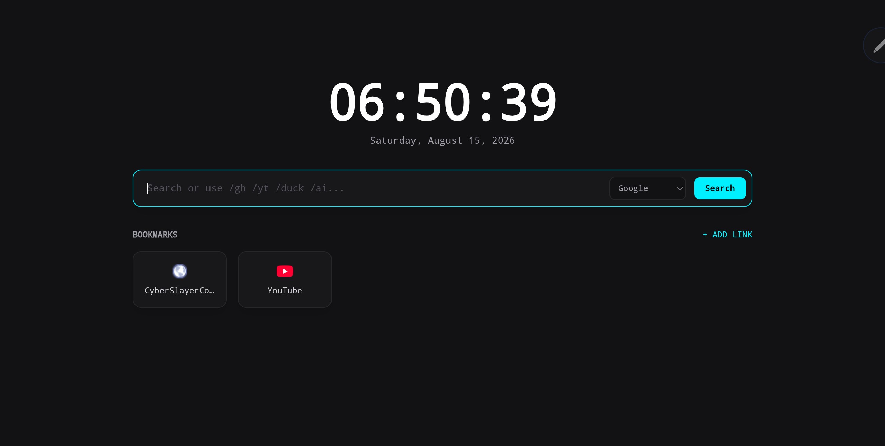

# CyberTab

A futuristic new-tab page with a neon-black aesthetic — fast, minimal, and deeply customizable.

CyberTab gives your browser a moody, retro-futuristic new-tab experience with three core features you'll love:

- Bookmarks section: quick access to your most-used sites with large neon tiles.
- Search engine changer: pick or add the search engine you want and search right from the bar.
- Neon black vibe: dark background with high-contrast neon accents for a sleek, cyberpunk look.

---

## Features

- Clean, responsive new-tab layout optimized for both wide and narrow screens.
- Bookmarks panel with visual tiles, drag-and-drop reordering, and optional folder grouping.
- Search bar with a selectable search engine dropdown — switch between engines instantly.
- Theme built around a neon-on-black color palette, with simple CSS variables so you can tweak colors and glow intensity.
- Lightweight and privacy-minded: no trackers and no external analytics by default.

---

## Demo

Open a new tab page at cyber-tab-mu.vercel.app to see the neon-black UI. The main view shows a centered search bar, the current date and time, and a grid of bookmarks below it.

---

## Installation

- this is a static page: host the files on any static server and set the page as your new tab or homepage.

---

## Using CyberTab

Bookmarks
- Add bookmarks via the + button in the bookmarks section.
- Click a tile to open the site in a new tab.

Search engines
- Use the main search bar to query the web. A small dropdown on the left of the bar shows the active search engine.
- Click the dropdown to switch engines (Google, DuckDuckGo, Bing, etc.)

---

## Privacy

CyberTab is designed to be local-first. By default it:
- Stores bookmarks and settings locally in your browser (localStorage or extension storage).
- Does not send browsing data or telemetry to external servers.

---

## Contributing

Contributions are welcome! If you'd like to help:
- Open an issue to propose features or report bugs.
- Fork the repo, make changes, and submit a pull request.
- Keep UI/UX changes consistent with the neon-black theme.

Please include screenshots and a short description of the change in your PR.

---

## Development notes

- The UI is built with simple HTML/CSS/JS (no heavy framework) so it’s easy to edit and extend.

---
